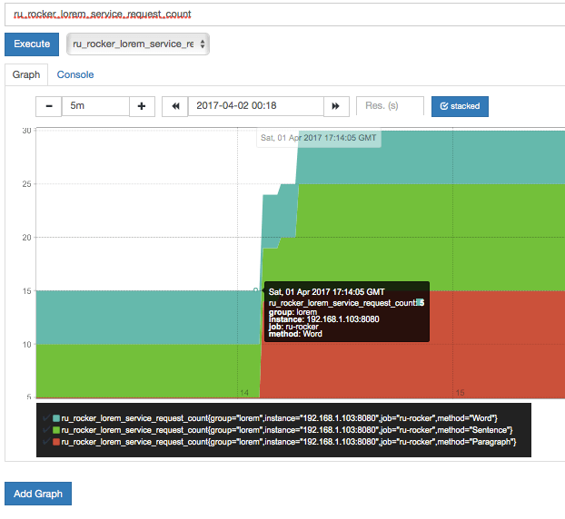
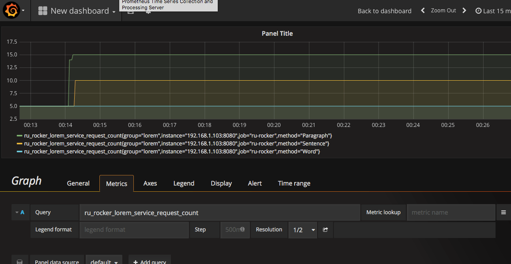

# go-kit实现API接口监控

参考文章

1. [Micro-services Using go-kit: Service Discovery](http://www.ru-rocker.com/2017/04/17/micro-services-using-go-kit-service-discovery/)

由于API接口是你的服务与外界交互的唯一手段, 所以对API的监控十分重要.

## 1. 概览

一般来说, 所有在线服务都需要被监控. 监控是一个至关重要的组件, 因为我们希望能确保我们的服务一切正常. 在微服务架构中当然也是如此. 我们需要实时监控我们的API, 并保留历史记录以便了解一直以来服务是否运行良好. 另一个原因就是可以发现API调用之间的瓶颈, 这样我们可以对接口中出现的任何问题都能迅速做出反应.

## 2. Prometheus(普罗米修斯)

`Prometheus`是一个流行的, 可以存储时序数据的监控工具. ta提供了多种度量(metric)种类, 如: `Counter(计数器)`, `Gauge(仪表)`, `Histogram(柱状图)`和`Summary(梗概)`. ta还提供了对时序数据的选择/聚合操作的功能表达式, 其结果可以通过图样或表格展示出来.

不过, 有时我们还是想要更好的可视化效果. 此时我们可以结合使用`Prometheus`和[Grafana](https://grafana.com/), 于是得到一种数据分析与可视化的强大工具. `Prometheus`提供数据, 同时`Grafana`提供仪表盘接口来分析和展示这些数据.

### 2.1 Prometheus vs ELK

在我前面的[文章](http://www.ru-rocker.com/2017/03/12/micro-services-using-go-kit-centralized-logging-using-elk-stack/)中, 我曾讨论过使用ELK服务来做日志监控, 现在又有了`Prometheus`. ta们有什么区别? 

按照`Prometheus`的[FAQ](https://prometheus.io/docs/introduction/faq/)的说法, `Prometheus`是一个收集和处理度量信息的系统, 并不是一个事件监控系统, 所以两者在功能上有着明显的不同. 一个是收集事件日志(ELK), 另一个是收集和处理度量信息(Prometheus).

### 2.2 如何工作

简单来说, 我们可以在配置文件中配置我们要监控的目标. 然后`Prometheus`开始通过在这些目标上抓取HTTP端点来收集度量信息.

> 更多关于`Prometheus`和`Grafana`的信息, 可以访问ta们的官方网站[Prometheus](http://www.prometheus.io/)和[Grafana](http://www.grafana.com/).

## 3. 应用场景

在本文中, 我将监控请求总量和各请求的延迟信息. 然后我会暴露一个度量端点, `Prometheus`将会从这个端点抓取数据, 然后使用`Grafana`进行可视化的展示.

为了达到这个目的, 我将拷贝`lorem-rate-limit`目录, 并将其重命名为`lorem-metrics`.

> 注意: `Prometheus`和`Grafana`都使用Docker运行.

## 4. 一步一步来

开始之前先下载依赖库

```
# download prometheus library
go get github.com/prometheus/client_golang/prometheus
```

### 4.1 更新`instrument.go`

首先创建一个名为`metricsMiddleware`的结构体. 这个结构体扩展了`Service`对象, 新增了两个成员`requestCounter`和`requestLatency`.

```
// Make a new type and wrap into Service interface
// Add expected metrics property to this type
type metricsMiddleware struct {
	Service
	requestCount   metrics.Counter
	requestLatency metrics.Histogram
}
```

然后创建一个名为`Metrics`的函数, 这个函数接受两个参数: `requestCounter`和`requestLatency`, 并返回`ServiceMiddleware`装饰器函数.

```go
// metrics function
func Metrics(requestCount metrics.Counter,
	     requestLatency metrics.Histogram) ServiceMiddleware {
	return func(next Service) Service {
		return metricsMiddleware{
			next,
			requestCount,
			requestLatency,
		}
	}
}
```

然后为`metricsMiddleware`结构体实现`Service`中的方法.

```go
// Implement service functions and add label method for our metrics
func (mw metricsMiddleware) Word(min, max int) (output string) {
	defer func(begin time.Time) {
		lvs := []string{"method", "Word"}
		mw.requestCount.With(lvs...).Add(1)
		mw.requestLatency.With(lvs...).Observe(time.Since(begin).Seconds())
	}(time.Now())
	output = mw.Service.Word(min, max)
	return
}
// and the rest for Sentence and Paragraph
```

### 4.2 `transport.go`

我们需要为度量接口创建一个路由接口, 在`MakeHttpHandler`函数中添加如下代码

```go
// GET /metrics
r.Path("/metrics").Handler(stdprometheus.Handler())
```

### 4.3 `main.go`

在这个文件中, 我们首先要声明`requestCounter`变量. 这是一个计数器, 我们将使用`Prometheus Counter`度量类型. 以及另外一个`Summary`类型的变量`requestLatency`.

```go
//declare metrics
fieldKeys := []string{"method"}
requestCount := kitprometheus.NewCounterFrom(stdprometheus.CounterOpts{
	Namespace: "ru_rocker",
	Subsystem: "lorem_service",
	Name:      "request_count",
	Help:      "Number of requests received.",
}, fieldKeys)
requestLatency := kitprometheus.NewSummaryFrom(stdprometheus.SummaryOpts{
	Namespace: "ru_rocker",
	Subsystem: "lorem_service",
	Name:      "request_latency_microseconds",
	Help:      "Total duration of requests in microseconds.",
}, fieldKeys)
```

然后将其链接到已经存在的服务中

```go
// chaining service
var svc lorem_metrics.Service
svc = lorem_metrics.LoremService{}
svc = lorem_metrics.LoggingMiddleware(logger)(svc)
svc = lorem_metrics.Metrics(requestCount, requestLatency)(svc) // 高亮行
```

注意: 高亮行将度量metrics加入了service对象中.

### 4.4 Prometheus和Grafana

如上所说, 我们使用docker compose运行`Prometheus`和`Grafana`. 我们使用ta们各自的官方镜像: `prom/prometheus`和`grafana/grafana`.

#### 4.5.1 Prometheus

在docker中运行`Prometheus`, 我们至少需要准备`prometheus.yml`并将其挂载到容器中.

```yml
global:
  scrape_interval:     15s # By default, scrape targets every 15 seconds.
  external_labels:
    monitor: 'rurocker-monitor'

scrape_configs:
  - job_name: 'prometheus'
    scrape_interval: 5s
    static_configs:
      - targets: ['localhost:9090']
        labels:
          group: 'local'

  - job_name: 'ru-rocker'
    scrape_interval: 5s
    static_configs:
      - targets: ['192.168.1.103:8080'] ## 高亮行
        labels:
          group: 'lorem'
```

> 注意: 高亮行使用IP地址而不是localhost来访问lorem服务是因为此配置将在容器中使用, lorem服务相对于容器并不能通过localhost访问到.

#### 4.5.2 Grafana

对于`Grafana`, 我们需要创建一个空目录`grafana_db`挂载入容器中(目录名称随意), 这个目录用来作为SQLite数据的存储目录. 没错, grafana用SQLite存储数据. 下一步是使用环境变量, 用`GF_SECURITY_ADMIN_PASSWORD`字段指定管理员的密码.

`docker-compose-prometheus-grafana.yml`

```go
version: '2'

services:
  prometheus:
    image: prom/prometheus
    ports:
      - 9090:9090
    volumes:
      - $PWD/lorem-rate-limit/prometheus/prometheus.yml:/etc/prometheus/prometheus.yml
  grafana:
    image: grafana/grafana
    ports:
      - 3000:3000
    environment:
      - GF_SECURITY_ADMIN_PASSWORD=password
    volumes:
      - $PWD/extra/grafana_db:/var/lib/grafana grafana/grafana
```

### 4.6 运行

现在运行我们的示例工程. 首先启动`lorem`服务并检测`/metrics`接口是否可以访问. 我们先发送一些请求, 然后查看度量数据. 然后启动容器运行`Prometheus`和`Grafana`.

**lorem-server**

```
# start service
cd $GOPATH/src/github.com/ru-rocker/gokit-playground
go run lorem-metrics/lorem-metrics.d/main.go

# calling service via CURL
# you can execute this multiple times in a different time to get a nice spectrum
for i in 1 2 3 4 5; do curl -X POST localhost:8080/lorem/word/10/10; done
for i in 1 2 3 4 5; do curl -X POST localhost:8080/lorem/sentence/10/10; done
for i in 1 2 3 4 5; do curl -X POST localhost:8080/lorem/paragraph/10/10; done
```

**Prometheus - Grafana**

```
cd $GOPATH/src/github.com/ru-rocker/gokit-playground
docker-compose -f docker/docker-compose-prometheus-grafana.yml up -d
```

如果一切工作正常, 你可以通过`localhost:9090`访问`Prometheus`, 并且通过`localhost:3000`访问`Grafana`. `Grafana`会底部你用户名和密码, 你可以输入用户名`admin`, 和你在compose配置文件中`GF_SECURITY_ADMIN_PASSWORD`字段的值.

第一次登录我们需要配置`Grafana`. 

首先设置数据源. 创建一个新的数据源, 输入名称, 选择类型: `Prometheus`并且设置URL为`localhost:9090`. 

然后设置仪表盘. 创建一个新的仪表盘(Menu->Dashboard->New), 然后点击`Graph`按钮.

然后点击`Panel Title(面板标题)`点击`Edit(编辑)`, 然后可以看到在面板下方出现`Metrics`标签. 

你可以使用query表达式去收集`lorem`服务的度量信息. 在本例中, 我将收集每种方法(word, sentence或paragraph)的请求总量.





注意: 你可以尝试另外一种查询语句来得到请求延迟信息.

## 5. 结论

无论何时我们将API接口对外开放, 考虑接口的数据可视化都是很好的时机. 我们需要知道服务是否正常工作, 因此需要监控工具.

go-kit拥有支持这类功能的特性. 我们不需要重构已经实现的代码, 只需要加入度量功能, 将其包裹成服务并暴露度量接口就可以了.

然而, 即使拥有精巧且高端的监控系统, 没有我们的响应也无济于事. 监控, 总是需要有人来处理的.

好了, 到这里就结束了, 本例中所用的代码在我的[github](https://github.com/ru-rocker/gokit-playground).