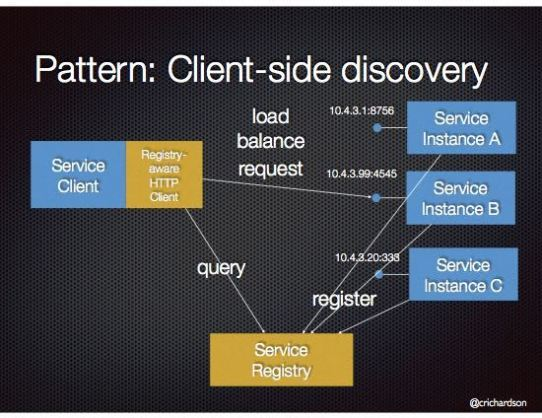
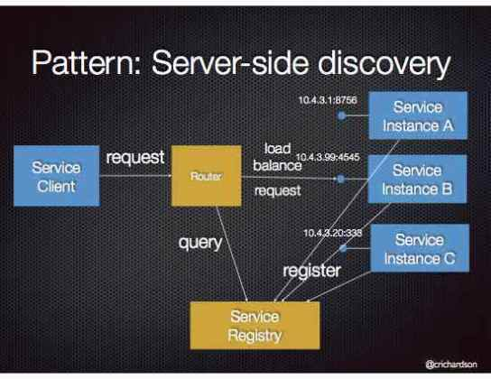

# go-kit服务发现

参考文章

1. [Micro-services Using go-kit: Service Discovery](http://www.ru-rocker.com/2017/04/17/micro-services-using-go-kit-service-discovery/)

在实例数量和网络地址动态变化的环境中, 客户端需要一个发现机制来确认服务端实例的地址, 之后才能向其发送请求.

## 1. 概览

现如今, 基于微服务的应用大多运行在容器化的环境中, 其中最主要的原因是服务必须基于自身所需资源单独扩展. 容器本身具有增加实例数量和改变网络地址的灵活性, 但是这种动态性对我们的客户端代码带来了另一种影响, 我们必须找到要发送请求的目标服务. 这样的后果导致我们必须建立一个服务发现机制.

### 1.1 客户端服务发现

基本上, 服务发现就是一种客户端不需要知道服务在哪个位置就能查找到服务的机制. 当然, 客户端还是要通过[服务中心](http://microservices.io/patterns/service-registry.html)查询服务实例的位置的, 然后客户端再将请求发送给相关的实例.



### 1.2 服务端服务发现

在这种机制中, 客户端通过路由来发送请求, 而不是先从服务中心查询实例地址. 这个路由会自行查询服务中心, 并且将请求转发给目标服务实例.



## 2. Consul

简单来说, `consul`就是一个工具, 用于发现和配置基础设施中的服务. ta提供了几个主要特性如服务发现, 健康检查, 键-值存储和多数据中心部署.

在这篇文章中, 我将用到其中的两个特性. 第一个当然是服务发现功能, 另外一个就是健康检查. 健康检查基本上就是检查一个服务是否正常工作, 以确认其是否能处理请求.

> 更多关于`consul`的细节和特性可以访问[consul官网](https://www.consul.io/intro/index.html)
> 供参考: `consul`并不是可用于服务发现的唯一工具, 市面上还有几个另外的工具如[etcd](https://github.com/coreos/etcd)和[Apache Zookeeper](http://zookeeper.apache.org/).

## 3. 使用场景

本文将使用客户端服务发现机制. 首先, 我需要将`Lorem`服务注册到`consul`中. 然后创建一个客户端, 从`consul`注册中心查询并关联`Lorem`服务. 客户端本身也在`sd-lorem`上下文路径下暴露一个服务. 另外, 我还将在已有的服务中创建一个健康检查函数, 以提供服务是否正常运行的状态信息给`consul`.

在前面的文章中, `Lorem`服务只与URL关联, 不需要请求体(毕竟是restful接口), 然后返回结果. 这一次`sd-lorem`端点将有所不同, 我将使用带有请求体的POST请求来关联端点. 请求体格式为json, 结构如下

```json
{
    "requestType": "word",
    "min": 10,
    "max": 10
}
```

另外, 我会用docker来运行`consul`, 用的镜像是`progrium/consul`. 因为本文的目的是展现如何使用`consul`实现服务发现, 所以只会运行单个`consol`服务器. 不过并不建议在生产环境这么做, 因为你需要部署一套集群. 更多更详细的信息, 可以查阅`consul`的[官方文档](https://www.consul.io/intro/getting-started/join.html).

## 4. 一步一步来

首先拷贝`lorem-metrics`目录, 并将其命名为`lorem-consul`. 然后启动`consul agent`, 输入如下命令:

```
# execute docker for consul
docker run --rm -p 8400:8400 -p 8500:8500 -p 8600:53/udp -h node1 progrium/consul -server -bootstrap -ui-dir /ui
```

### 4.1 `service.go`

在服务接口中新增一个`HealthCheck`方法, 然后实现ta. 此方法不接受参数, 返回的是一个布尔值.

```go
// declare new function
type Service interface {
	// existing function here....
	
	// health check
	HealthCheck() bool
}

//new implementation of HealthCheck function
//existing function here...
func (LoremService) HealthCheck() bool {
	//to make the health check always return true is a bad idea
	//however, I did this on purpose to make the sample run easier.
	//Ideally, it should check things such as amount of free disk space or free memory
	return true
}
```

注意: `HealthCheck`的实现十分简单. 只要返回`true`, 响应码就会是200. 不过在生产环境中直接返回中`true`并不是一个好主意(译者注: 起码查查数据库连接, 依赖服务是不是还正常呀)

### 4.2 `logging.go`和`instrument.go`

在前面的文章中, 我们使用`loggingMiddleware`和`metricsMiddleware`中间件扩展了`Service`接口, 然后我们在每个中间件结构中都实现了服务方法`Lorem`. 这就造成了这样一种后果, 我们在`Service`接口中添加了`HealthCheck`方法, 那么就需要在`loggingMiddleware`和`metricsMiddleware`中间件也实现这个方法...

`logging.go`

```go
// implement logging feature in HealthCheck function
func (mw loggingMiddleware) HealthCheck() (output bool) {
	defer func(begin time.Time){
		mw.logger.Log(
			"function","HealthCheck",
			"result", output,
			"took", time.Since(begin),
		)
	}(time.Now())
	output = mw.Service.HealthCheck()
	return
}
```

`instrument.go`

```go
// implement metrics feature in HealthCheck function
func (mw metricsMiddleware) HealthCheck() (output bool) {
	defer func(begin time.Time) {
		lvs := []string{"method", "HealthCheck"}
		mw.requestCount.With(lvs...).Add(1)
		mw.requestLatency.With(lvs...).Observe(time.Since(begin).Seconds())
	}(time.Now())
	output = mw.Service.HealthCheck()
	return
}
```

> 译者注: 突然觉得好sb有木有?

### 4.3 `endpoint.go`

这一步就很清晰了, 因为我们还需要为`HealthCheck`暴露endpoint端点, 然后`consul`来访问, 就能确定服务状态了.

```go
//Health Request
type HealthRequest struct {

}

//Health Response
type HealthResponse struct {
	Status bool `json:"status"`
}

// creating health endpoint
func MakeHealthEndpoint(svc Service) endpoint.Endpoint {
	return func(ctx context.Context, request interface{}) (interface{}, error) {
		status := svc.HealthCheck()
		return HealthResponse{Status: status}, nil
	}
}
```

### 4.4 `transport.go`

创建完endpoint函数后, 我们需要为`HealthCheck`添加一条路由处理函数, 这里我们使用`/health`路径. 与之前一样, 我们首先要创建`decode`函数.

```go
// decode health check
func decodeHealthRequest(_ context.Context, _ *http.Request) (interface{}, error) {
	return HealthRequest{}, nil
}

// Make Http Handler
func MakeHttpHandler(_ context.Context, endpoint Endpoints, logger log.Logger) http.Handler {

	//Existing handler here...

	//GET /health
	r.Methods("GET").Path("/health").Handler(httptransport.NewServer(
		endpoint.HealthEndpoint,
		decodeHealthRequest,
		EncodeResponse,
		options...,
	))
	return r
}
```

### 4.5 `registration.go`

这是一个新文件, 用于将服务注册到`consul`. 在这个文件里, 我们将创建一个名为`Register`的函数, 这个函数接受4个参数:

1. `Consul Address`: consul agent的IP地址
2. `Consul Port`: consul agent的端口
3. `Advertised Address`: 服务实例IP
4. `Advertised Port`: 服务实例的端口

此函数返回一个go-kit中的`Registrar`接口.

> 译者注: 前两个参数很好理解, 后两个参数其实就是前往注册的服务本身的地址, 这个地址一定要`consul`可以反向访问到, 否则健康检查接口无法访问, 服务就直接不开放给客户端; 同时这个地址也需要让客户端可以访问到, 这个就不必说了. ..只是一个服务确定运行端口不难, 能确定服务地址的话为啥不直接写到客户端呢? 这不是多此一举吗? 难道每次启动服务都需要重新确认IP? 

基本上, `Register`函数就是使用`consul`API接口去注册服务, 同时告诉`consul`健康检查的端点.

```go
// registration
func Register(consulAddress string,
	consulPort string,
	advertiseAddress string,
	advertisePort string) (registar sd.Registrar) {

	// Logging domain.
	var logger log.Logger
	{
		logger = log.NewLogfmtLogger(os.Stderr)
		logger = log.With(logger, "ts", log.DefaultTimestampUTC)
		logger = log.With(logger, "caller", log.DefaultCaller)
	}

	rand.Seed(time.Now().UTC().UnixNano())


	// Service discovery domain. In this example we use Consul.
	var client consulsd.Client
	{
		consulConfig := api.DefaultConfig()
		consulConfig.Address = consulAddress + ":" + consulPort
		consulClient, err := api.NewClient(consulConfig)
		if err != nil {
			logger.Log("err", err)
			os.Exit(1)
		}
		client = consulsd.NewClient(consulClient)
	}

	check := api.AgentServiceCheck{
		HTTP:     "http://" + advertiseAddress + ":" + advertisePort + "/health",
		Interval: "10s",
		Timeout:  "1s",
		Notes:    "Basic health checks",
	}

	port, _ := strconv.Atoi(advertisePort)
	num := rand.Intn(100) // to make service ID unique
	asr := api.AgentServiceRegistration{
		ID:      "lorem" + strconv.Itoa(num), //unique service ID
		Name:    "lorem", // 高亮行
		Address: advertiseAddress,
		Port:    port,
		Tags:    []string{"lorem", "ru-rocker"}, // 高亮行
		Check:   &check,
	}
	registar = consulsd.NewRegistrar(client, &asr, logger)
	return
}
```

注意: 高亮行是用于查询一个指定服务的关键. `Consul`使用服务的名称和标签来查找.

### 4.6 `lorem-consul.d/main.go`

在这个文件(其实就是程序主入口)中, 我们需要为健康检查服务创建端点, 然后通过调用`Register`函数将服务注册到`consul`. 接下来调用`registar.Register()`函数, 然后才能启动HTTP服务器. 然后在HTTP服务终止时还要调用`registart.Deregister()`函数.

```go
// inside main function ...

// parse variable from input command
var (
  consulAddr = flag.String("consul.addr", "", "consul address")
  consulPort = flag.String("consul.port", "", "consul port")
  advertiseAddr = flag.String("advertise.addr", "", "advertise address")
  advertisePort = flag.String("advertise.port", "", "advertise port")
)
flag.Parse()

// existing implementation here...
	
// Make health endpoint
healthEndpoint := lorem_consul.MakeHealthEndpoint(svc)
endpoint := lorem_consul.Endpoints{
  LoremEndpoint: e,
  HealthEndpoint: healthEndpoint,
}

// Register Service to Consul
registar := lorem_consul.Register(*consulAddr,
  *consulPort,
  *advertiseAddr,
  *advertisePort)

// HTTP transport
go func() {
  ilog.Println("Starting server at port", *advertisePort)
  // register service
  // 高亮行
  registar.Register()
  handler := r
  errChan <- http.ListenAndServe(":" + *advertisePort, handler)
}()

go func() {
  c := make(chan os.Signal, 1)
  signal.Notify(c, syscall.SIGINT, syscall.SIGTERM)
  errChan <- fmt.Errorf("%s", <-c)
}()

error := <- errChan
// deregister service
// 高亮行
registar.Deregister()
ilog.Fatalln(error)
```

注意: 高亮行表示consul的注册与注销.

### 5.7 `discover.d/main.go`

这里是客户端主程序. 在这一步, 我们创建一个`discover.d`目录并在其中创建`main.go`文件. 因为与之前的`Lorem`服务相比, 这次我们使用了不同的请求体, 所以首先我们需要为我们的客户端请求添加`decode`和`encode`函数.

```go
// decode request from discovery service
// parsing JSON into LoremRequest 
func decodeConsulLoremRequest(_ context.Context, r *http.Request) (interface{}, error) {
	var request lorem_consul.LoremRequest
	if err := json.NewDecoder(r.Body).Decode(&request); err != nil {
		return nil, err
	}
	return request, nil
}

// Encode request form LoremRequest into existing Lorem Service
// The encode will translate the LoremRequest into /lorem/{requestType}/{min}/{max}
func encodeLoremRequest(_ context.Context, req *http.Request, request interface{}) error {
	lr := request.(lorem_consul.LoremRequest)
	p := "/" + lr.RequestType + "/" + strconv.Itoa(lr.Min) + "/" + strconv.Itoa(lr.Max)
	req.URL.Path += p
	return nil
}
```

然后还要为响应创建`encode`和`decode`函数. 因为返回的响应体不变, 我们不需要重新定义`encode`函数, 直接使用已经存在的`EncodeResponse`函数. 这样我们只需要实现`decode`函数.

```go
// decode response from Lorem Service
func decodeLoremResponse(_ context.Context, resp *http.Response) (interface{}, error) {
	var response lorem_consul.LoremResponse
	var s map[string]interface{}

	if respCode := resp.StatusCode; respCode >= 400 {
		if err := json.NewDecoder(resp.Body).Decode(&s); err != nil{
			return nil, err
		}
		return nil, errors.New(s["error"].(string) + "\n")
	}

	if err := json.NewDecoder(resp.Body).Decode(&response); err != nil {
		return nil, err
	}

	return response, nil
}
```

接下来, 创建一个工厂函数, 用来从发现的服务地址构造URL, 同时设置`encode`和`decode`函数, 然后将其转化成`endpoint.Endpoint`函数.

```go
// factory function to parse URL from Consul to Endpoint
func loremFactory(_ context.Context, method, path string) sd.Factory {
	return func(instance string) (endpoint.Endpoint, io.Closer, error) {
		if !strings.HasPrefix(instance, "http") {
			instance = "http://" + instance
		}

		tgt, err := url.Parse(instance)
		if err != nil {
			return nil, nil, err
		}
		tgt.Path = path

		var (
			enc ht.EncodeRequestFunc
			dec ht.DecodeResponseFunc
		)
		enc, dec = encodeLoremRequest, decodeLoremResponse

		return ht.NewClient(method, tgt, enc, dec).Endpoint(), nil, nil
	}
}
```

最后就是`main`函数了, 这里我们将构造`consul`客户端, 订阅`consul agent`并从工厂端点创建一个HTTP处理函数.

```go
// main function
func main() {

	var (
		consulAddr = flag.String("consul.addr", "", "consul address")
		consulPort = flag.String("consul.port", "", "consul port")
	)
	flag.Parse()

	// Logging domain.
	var logger log.Logger
	{
		logger = log.NewLogfmtLogger(os.Stderr)
		logger = log.With(logger,"ts", log.DefaultTimestampUTC)
		logger = log.With(logger,"caller", log.DefaultCaller)
	}


	// Service discovery domain. In this example we use Consul.
	var client consulsd.Client
	{
		consulConfig := api.DefaultConfig()

		consulConfig.Address = "http://" + *consulAddr + ":" + *consulPort
		consulClient, err := api.NewClient(consulConfig)
		if err != nil {
			logger.Log("err", err)
			os.Exit(1)
		}
		client = consulsd.NewClient(consulClient)
	}

	tags := []string{"lorem", "ru-rocker"} // 高亮行
	passingOnly := true
	duration := 500 * time.Millisecond
	var loremEndpoint endpoint.Endpoint

	ctx := context.Background()
	r := mux.NewRouter()

    factory := loremFactory(ctx, "POST", "/lorem")
	serviceName := "lorem" // 高亮行
	subscriber := consulsd.NewSubscriber(client, factory, logger, serviceName, tags, passingOnly)
	balancer := lb.NewRoundRobin(subscriber)
	retry := lb.Retry(1, duration, balancer)
	loremEndpoint = retry

	// POST /sd-lorem
	// Payload: {"requestType":"word", "min":10, "max":10}
	r.Methods("POST").Path("/sd-lorem").Handler(ht.NewServer(
		loremEndpoint,
		decodeConsulLoremRequest,
		lorem_consul.EncodeResponse, // use existing encode response since I did not change the logic on response
	))

	// Interrupt handler.
	errc := make(chan error)
	go func() {
		c := make(chan os.Signal)
		signal.Notify(c, syscall.SIGINT, syscall.SIGTERM)
		errc <- fmt.Errorf("%s", <-c)
	}()

	// HTTP transport.
	go func() {
		logger.Log("transport", "HTTP", "addr", "8080")
		errc <- http.ListenAndServe(":8080", r)
	}()

	// Run!
	logger.Log("exit", <-errc)
}
```

注意: 高亮行使用与第5步中相同的名称和标签, consul才会找到符合条件的服务实例.

### 4.8 运行示例

在这个示例中, 我将运行两个实例, ta们会分别注册到consul, 运行端口各自为7002和7003.

```
# Running in separate console
cd $GOPATH/src/github.com/ru-rocker/gokit-playground

go run lorem-consul/lorem-consul.d/main.go  \
   -consul.addr localhost -consul.port 8500 \
   -advertise.addr 192.168.1.103 -advertise.port 7002

go run lorem-consul/lorem-consul.d/main.go  \
   -consul.addr localhost -consul.port 8500 \
   -advertise.addr 192.168.1.103 -advertise.port 7003
```

> 注意: consul agent要事先启动.

服务启动后, 可以在命令行看到如下相似输出:

```
# service on port 7002
2017/04/16 23:14:16 Starting server at port 7002
ts=2017-04-16T16:14:16.430222994Z caller=registrar.go:33 service=lorem tags="[lorem ru-rocker]" address=192.168.1.103 action=register
ts=2017-04-16T16:14:18.573538644Z caller=logging.go:71 function=HealthCheck result=true took=997ns

# service on port 7003
2017/04/16 23:14:42 Starting server at port 7003
ts=2017-04-16T16:14:42.87250799Z caller=registrar.go:33 service=lorem tags="[lorem ru-rocker]" address=192.168.1.103 action=register
ts=2017-04-16T16:14:43.310868906Z caller=logging.go:71 function=HealthCheck result=true took=1.169µs

# consul agent console
2017/04/16 16:14:16 [INFO] agent: Synced service 'lorem91'
2017/04/16 16:14:19 [INFO] agent: Synced check 'service:lorem91'
2017/04/16 16:14:42 [INFO] agent: Synced service 'lorem17'
2017/04/16 16:14:43 [INFO] agent: Synced check 'service:lorem17'
```

consul UI的web界面


现在启动客户端

```
# client
cd $GOPATH/src/github.com/ru-rocker/gokit-playground
go run lorem-consul/discover.d/main.go \
   -consul.addr localhost -consul.port 8500
```

然后我们用`curl`发几条请求

```
# send two request
$ curl -XPOST -d'{"requestType":"word", "min":10, "max":10}' http://localhost:8080/sd-lorem
$ {"message":"meminerunt"}
$ curl -XPOST -d'{"requestType":"word", "min":10, "max":10}' http://localhost:8080/sd-lorem
$ {"message":"quaecumque"}

# output in port 7002
ts=2017-04-16T16:24:38.924105072Z caller=logging.go:31 function=Word min=10 max=10 result=meminerunt took=20.607µs

# output in port 7003
ts=2017-04-16T16:24:39.958944257Z caller=logging.go:31 function=Word min=10 max=10 result=quaecumque took=4.217µs
```

## 5. 高级话题

关于接口监控, 暂时不翻译...

## 6. 总结

微服务架构的一个优势就不每个服务可以根据自身资源占用独立地扩展, 但这样做的一个后果就是, 需要一个服务中心.

`Consul`提供了出色的工具来解决这个需求-服务发现功能. 此外, go-kit本身作为一个微服务框架, 也在`github.com/go-kit/kit/sd`构建了服务发现的标准库. ta们两者满足我们大部分对服务注册中心的需求. 感谢那些提供了优秀的库和工具的开发者们.

完整代码在我的[github](https://github.com/ru-rocker/gokit-playground), `lorem-consul`目录下.

## 7. 参考

- [Service Discovery Architecture](https://www.nginx.com/blog/service-discovery-in-a-microservices-architecture/)
- [Client Side Service Discovery](http://microservices.io/patterns/client-side-discovery.html)
- [Server Side Service Discovery](http://microservices.io/patterns/server-side-discovery.html)
- [Consul](https://www.consul.io/)
