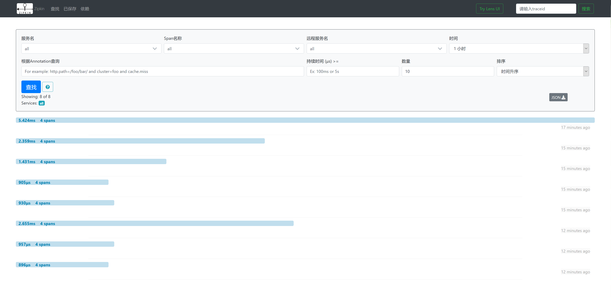
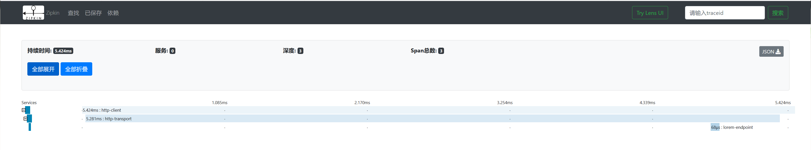
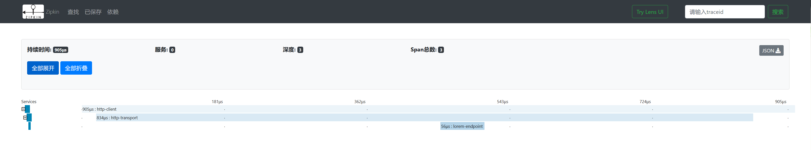

参考文章

1. [go-kit微服务：服务链路追踪](https://juejin.im/post/5c77bb8b6fb9a04a027b0b99)
2. [六、go-kit 微服务请求跟踪介绍](https://hacpai.com/article/1525401758789)

...本来觉得参考文章1介绍的很清晰, 直接编写一个以consul服务发现为基础的tracing服务的, 结果高看自己了, ta的架构与我的lorem示例不太一样, 于是就耸了.

参考文章1中的示例中, gateway为用户请求的入口, 然后将请求转发给后端的子服务, 起了类似路由的功能. 本来这与我们的consul示例[62.gokit-lorem-consul-client](https://github.com/generals-space/gokit/tree/master/06.gokit-playground-example/62.gokit-lorem-consul-client)的思路是差不多的, 但是ta集成consul api的方法是直接使用consul官方提供的client., 而不是go-kit内置的`sd`库中的client. 

由于go-kit内置的sd库集成consul算是比较核心的代码, 而我也是刚接触zipkin, 改完之后运行不成功...于是有了本示例.

本示例以[05.gokit-lorem-restful-lb](https://github.com/generals-space/gokit/tree/master/06.gokit-playground-example/05.gokit-lorem-restful-lb)为基础, 没有集成consul服务发现功能, 只是简单的将工程分为server端与client端, 其中client端提供的http接口也是用户的访问入口, 然后由client将请求通过transport层转发给server.

使用docker-compose启动后, 访问客户端, 可得到如下输出.

```
$ curl -XPOST -d '{"requestType":"sentence", "min":5, "max":20}' http://localhost:8090/sd-lorem
{"message":"Re cavernis tot ipsa qui at os me indicabo, te tuetur audi pati sim da ita."}
```

访问zipkin服务, 点击查找, 按时间排序, 可得到如下输出



注意: 各请求之间的耗时是有规律的, 第一次的请求耗时最长, 之后我又连续请求3次, 稍微停顿一下再请求第5次. 可以看到第2-4条请求的耗时依次减少.

如下分别是第1次请求(耗时最长)和第4次请求(耗时最短)的span截图.





你会发现实际差距就在于`http-transport`这部分. 这是由于client需要发起http请求, 而三次握手是相当耗时的过程.

猜测在连续频繁地发起请求时, 由于http1.1的`keep-alive`属性, 将使得客户端与服务端建立连接时可以重用之前的socket连接, 节省了大量时间, 因此造成了第2-4次请求耗时降低的结果.

为了验证我的猜测, 隔了一段时间(大概是3-5分钟)我又进行了3次请求, 结果如我所料.
